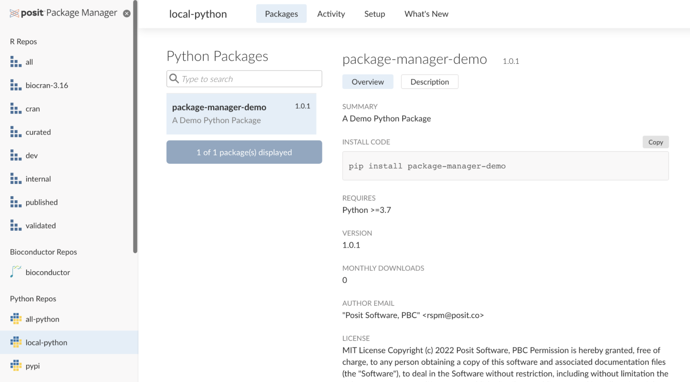

# ferryland

A Python package for interacting with the Washington State Department of Transportation's (WSDOT) traffic API: https://wsdot.wa.gov/traffic/api/.

## Install

Install ferryland:

```bash
pip install --index-url https://pkg.ferryland.posit.team/git-python/latest/simple --extra-index-url https://packagemanager.posit.co/pypi/latest/simple ferryland
```

## Usage

```python
>>> from datetime import date
>>>
>>> from ferryland.ferryland import VesselsAPI
>>>
>>>
>>> vessels_api = VesselsAPI()
>>>
>>> vessel_accommodations = vessels_api.vessel_accommodations()
>>> print(vessel_accommodations)
shape: (21, 14)
┌──────────┬─────────────────┬─────────────┬──────────────┬───┬───────────────────┬────────────┬─────────────────────────────────┬────────────────────┐
│ VesselID ┆ VesselSubjectID ┆ VesselName  ┆ VesselAbbrev ┆ … ┆ MainCabinRestroom ┆ PublicWifi ┆ ADAInfo                         ┆ AdditionalInfo     │
│ ---      ┆ ---             ┆ ---         ┆ ---          ┆   ┆ ---               ┆ ---        ┆ ---                             ┆ ---                │
│ i64      ┆ i64             ┆ str         ┆ str          ┆   ┆ bool              ┆ bool       ┆ str                             ┆ str                │
╞══════════╪═════════════════╪═════════════╪══════════════╪═══╪═══════════════════╪════════════╪═════════════════════════════════╪════════════════════╡
│ 1        ┆ 1               ┆ Cathlamet   ┆ CAT          ┆ … ┆ true              ┆ false      ┆ The MV Cathlamet has elevator … ┆                    │
│ 2        ┆ 2               ┆ Chelan      ┆ CHE          ┆ … ┆ true              ┆ false      ┆ The MV Chelan has elevator acc… ┆                    │
│ 65       ┆ 428             ┆ Chetzemoka  ┆ CHZ          ┆ … ┆ true              ┆ false      ┆ MV Chetzemoka has elevator acc… ┆ null               │
│ 74       ┆ 487             ┆ Chimacum    ┆ CHM          ┆ … ┆ true              ┆ false      ┆ The vessel has two ADA complia… ┆ null               │
│ 15       ┆ 15              ┆ Issaquah    ┆ ISS          ┆ … ┆ true              ┆ false      ┆ The MV Issaquah has elevator a… ┆                    │
│ …        ┆ …               ┆ …           ┆ …            ┆ … ┆ …                 ┆ …          ┆ …                               ┆ …                  │
│ 33       ┆ 33              ┆ Tillikum    ┆ TIL          ┆ … ┆ true              ┆ false      ┆ The MV Tillikum has an elevato… ┆                    │
│ 68       ┆ 462             ┆ Tokitae     ┆ TOK          ┆ … ┆ true              ┆ false      ┆ The vessel has two ADA complia… ┆ null               │
│ 36       ┆ 36              ┆ Walla Walla ┆ WAL          ┆ … ┆ true              ┆ false      ┆ The MV Walla Walla has elevato… ┆                    │
       │   ┆ 37              ┆ Wenatchee   ┆ WEN          ┆ … ┆ true              ┆ false      ┆ The MV Wenatchee has elevator … ┆ 27 May 1998
│          ┆                 ┆             ┆              ┆   ┆                   ┆            ┆                                 ┆ Todd Pacific Ship… │
│ 38       ┆ 38              ┆ Yakima      ┆ YAK          ┆ … ┆ true              ┆ false      ┆ The MV Yakima has elevator acc… ┆                    │
└──────────┴─────────────────┴─────────────┴──────────────┴───┴───────────────────┴────────────┴─────────────────────────────────┴────────────────────┘
>>>
>>> vessel_history = vessels_api.vessel_history(
...     vessel_name="Spokane",
...     date_start=date(2024, 1, 1),
...     date_end=date(2024, 1, 7)
... )
print(vessel_history)

vessel_verbose = vessels_api.vessel_verbose()
print(vessel_verbose)
>>> print(vessel_history)
shape: (178, 8)
┌──────────┬─────────┬───────────┬──────────┬────────────────────────────┬────────────────────────────┬────────────────────────────┬────────────────────────────┐
│ VesselId ┆ Vessel  ┆ Departing ┆ Arriving ┆ ScheduledDepart            ┆ ActualDepart               ┆ EstArrival                 ┆ Date                       │
│ ---      ┆ ---     ┆ ---       ┆ ---      ┆ ---                        ┆ ---                        ┆ ---                        ┆ ---                        │
│ i64      ┆ str     ┆ str       ┆ str      ┆ str                        ┆ str                        ┆ str                        ┆ str                        │
╞══════════╪═════════╪═══════════╪══════════╪════════════════════════════╪════════════════════════════╪════════════════════════════╪════════════════════════════╡
│ 21       ┆ Spokane ┆ Kingston  ┆ Edmonds  ┆ /Date(1704113100000-0800)/ ┆ /Date(1704113209000-0800)/ ┆ /Date(1704115070000-0800)/ ┆ /Date(1704113100000-0800)/ │
│ 21       ┆ Spokane ┆ Edmonds   ┆ Kingston ┆ /Date(1704116100000-0800)/ ┆ /Date(1704117854000-0800)/ ┆ /Date(1704118257000-0800)/ ┆ /Date(1704116100000-0800)/ │
│ 21       ┆ Spokane ┆ Kingston  ┆ Edmonds  ┆ /Date(1704119100000-0800)/ ┆ /Date(1704119373000-0800)/ ┆ /Date(1704120597000-0800)/ ┆ /Date(1704119100000-0800)/ │
│ 21       ┆ Spokane ┆ Edmonds   ┆ Kingston ┆ /Date(1704121800000-0800)/ ┆ /Date(1704121911000-0800)/ ┆ /Date(1704123176000-0800)/ ┆ /Date(1704121800000-0800)/ │
│ 21       ┆ Spokane ┆ Kingston  ┆ Edmonds  ┆ /Date(1704124500000-0800)/ ┆ /Date(1704124656000-0800)/ ┆ /Date(1704125923000-0800)/ ┆ /Date(1704124500000-0800)/ │
│ …        ┆ …       ┆ …         ┆ …        ┆ …                          ┆ …                          ┆ …                          ┆ …                          │
│ 21       ┆ Spokane ┆ Edmonds   ┆ Kingston ┆ /Date(1704690300000-0800)/ ┆ /Date(1704690423000-0800)/ ┆ /Date(1704691640000-0800)/ ┆ /Date(1704690300000-0800)/ │
│ 21       ┆ Spokane ┆ Kingston  ┆ Edmonds  ┆ /Date(1704692400000-0800)/ ┆ /Date(1704692453000-0800)/ ┆ /Date(1704693724000-0800)/ ┆ /Date(1704692400000-0800)/ │
│ 21       ┆ Spokane ┆ Edmonds   ┆ Kingston ┆ /Date(1704695100000-0800)/ ┆ /Date(1704695202000-0800)/ ┆ /Date(1704696551000-0800)/ ┆ /Date(1704695100000-0800)/ │
│ 21       ┆ Spokane ┆ Kingston  ┆ Edmonds  ┆ /Date(1704697800000-0800)/ ┆ /Date(1704697899000-0800)/ ┆ /Date(1704699131000-0800)/ ┆ /Date(1704697800000-0800)/ │
│ 21       ┆ Spokane ┆ Edmonds   ┆ Kingston ┆ /Date(1704699900000-0800)/ ┆ /Date(1704699983000-0800)/ ┆ /Date(1704701188000-0800)/ ┆ /Date(1704699900000-0800)/ │
└──────────┴─────────┴───────────┴──────────┴────────────────────────────┴────────────────────────────┴────────────────────────────┴────────────────────────────┘
>>>
>>> vessel_verbose = vessels_api.vessel_verbose()
>>> print(vessel_verbose)
shape: (21, 39)
┌──────────┬─────────────────┬─────────────┬──────────────┬───┬─────────────┬──────────────────┬────────────────┬─────────────────────────────────┐
│ VesselID ┆ VesselSubjectID ┆ VesselName  ┆ VesselAbbrev ┆ … ┆ YearRebuilt ┆ VesselDrawingImg ┆ SolasCertified ┆ MaxPassengerCountForInternatio… │
│ ---      ┆ ---             ┆ ---         ┆ ---          ┆   ┆ ---         ┆ ---              ┆ ---            ┆ ---                             │
│ i64      ┆ i64             ┆ str         ┆ str          ┆   ┆ i64         ┆ null             ┆ bool           ┆ i64                             │
╞══════════╪═════════════════╪═════════════╪══════════════╪═══╪═════════════╪══════════════════╪════════════════╪═════════════════════════════════╡
│ 1        ┆ 1               ┆ Cathlamet   ┆ CAT          ┆ … ┆ 1993        ┆ null             ┆ false          ┆ null                            │
│ 2        ┆ 2               ┆ Chelan      ┆ CHE          ┆ … ┆ 2005        ┆ null             ┆ true           ┆ 1090                            │
│ 65       ┆ 428             ┆ Chetzemoka  ┆ CHZ          ┆ … ┆ null        ┆ null             ┆ false          ┆ null                            │
│ 74       ┆ 487             ┆ Chimacum    ┆ CHM          ┆ … ┆ null        ┆ null             ┆ false          ┆ null                            │
│ 15       ┆ 15              ┆ Issaquah    ┆ ISS          ┆ … ┆ 1989        ┆ null             ┆ false          ┆ null                            │
│ …        ┆ …               ┆ …           ┆ …            ┆ … ┆ …           ┆ …                ┆ …              ┆ …                               │
│ 33       ┆ 33              ┆ Tillikum    ┆ TIL          ┆ … ┆ 1994        ┆ null             ┆ false          ┆ null                            │
│ 68       ┆ 462             ┆ Tokitae     ┆ TOK          ┆ … ┆ null        ┆ null             ┆ false          ┆ null                            │
│ 36       ┆ 36              ┆ Walla Walla ┆ WAL          ┆ … ┆ 2003        ┆ null             ┆ false          ┆ null                            │
│ 37       ┆ 37              ┆ Wenatchee   ┆ WEN          ┆ … ┆ null        ┆ null             ┆ false          ┆ null                            │
│ 38       ┆ 38              ┆ Yakima      ┆ YAK          ┆ … ┆ 2000        ┆ null             ┆ false          ┆ null                            │
└──────────┴─────────────────┴─────────────┴──────────────┴───┴─────────────┴──────────────────┴────────────────┴─────────────────────────────────┘
>>>
```

## Package Development 101

### What are Python Packages?

- Python packages are collections of functions and other objects that you can re-use across multiple projects
- Packages can include Python code, and/or code from other languages like Rust or C++.
- Most commonly, packages are published to PyPI. In our example project we publish this package to our internal Posit Package Manager instance.

### Python Packaging Tools

- There is a rich ecosystem of tools for developing Python packages
- My favourite tool is Poetry (https://python-poetry.org)
- We don’t have time to dive deep into building Python packages today, I would recommend this book as a starting point: https://py-pkgs.org

### Deploying Python Packages to Posit Package Manager

Posit Package Manager is a tool to host R and Python packages in your organization. With Posit Package Manager you can host in-house Python Packages that you only want to make available within your organization.

- https://posit.co/products/enterprise/package-manager/
- Uploading packages to Posit Package Manager: https://docs.posit.co/rspm/admin/getting-started/configuration/#quickstart-local-python
- Git backed deployment to Posit Package Manager: https://docs.posit.co/rspm/admin/getting-started/configuration/#quickstart-git-python



The package was deployed using the following commands:

```bash
# Set up the source and repo
rspm create source --type=git-python --name=internal-python-src
rspm create repo --name=git-python --description='Stable releases of our internal Python packages' --type=python
rspm subscribe --source=internal-python-src --repo=git-python

# Add the python package
rspm create git-builder --url=https://github.com/posit-conf-2024/ds-workflows-python --source=internal-python-src --build-trigger=tags --name=ferryland --sub-dir=materials/06-bonus-stuff/python-package

# Check the status
rspm list git-builds --source=internal-python-src --name=ferryland
rspm logs --transaction-id=[ID]

# Force a re-run if required
rspm rerun git-builder --name=ferryland --source=internal-python-src --tag=v0.1.0
```
