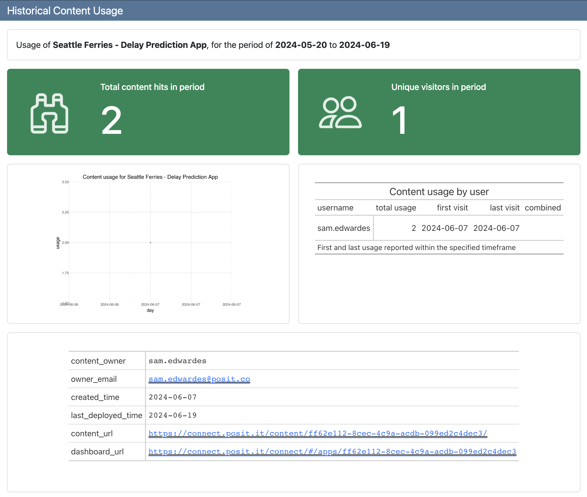

# Content Usage

The Posit SDK for Python (<https://github.com/posit-dev/posit-sdk-py>) makes it easy to interact with Posit Connect directly from Python. In this example, we create a usage report for our Shiny app that uses:

- posit-sdk-py: <https://github.com/posit-dev/posit-sdk-py>
- great-tables: <https://github.com/posit-dev/great-tables>
- quarto dashboard: <https://quarto.org/docs/dashboards/>

For more examples of what you can do with the Connect API and the Posit SDK see:

- posit-sdk-py: <https://github.com/posit-dev/posit-sdk-py>
- Posit Connect Cookbook: <https://docs.posit.co/connect/cookbook/>